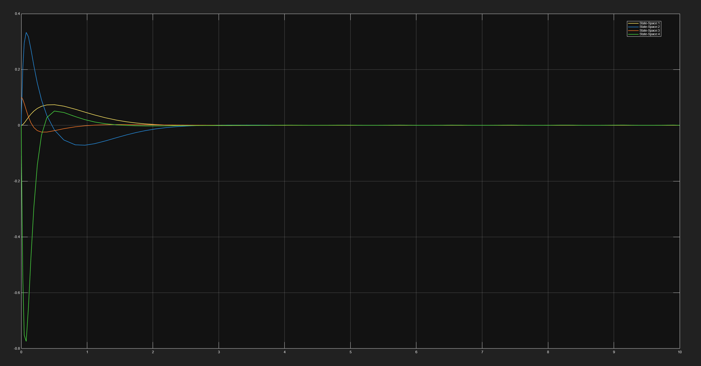
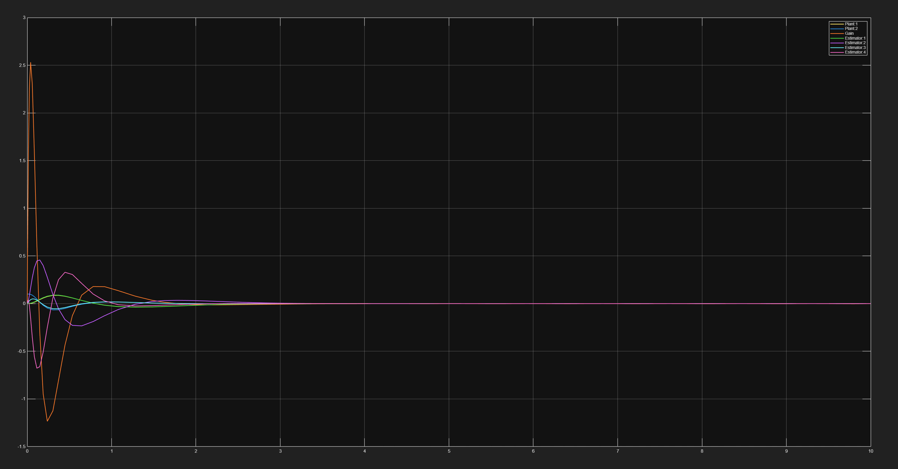

# Inverted Pendulum Stabilization using LQR and LQG

This project models a linearized inverted pendulum on a cart and stabilizes it using optimal control methods in MATLAB and Simulink.

## Project Goals

- Derive the state-space model
- Design an LQR controller
- Upgrade the controller to LQG using a Kalman state estimator
- Compare ideal full-state feedback against estimated-state feedback

## System Model

State vector:

$$
x = [x,\ \dot{x},\ \theta,\ \dot{\theta}]^T
$$

State-space form:

$$
\dot{x} = Ax + Bu
$$

## Control Design

The LQR controller uses:

$$
u = -Kx
$$

The LQG controller uses:

$$
u = -K\hat{x}
$$

where $\hat{x}$ is estimated using a Kalman filter.

## Results

## Key Takeaway

LQR stabilizes the pendulum using full-state feedback. LQG makes the controller more realistic by estimating unmeasured states from limited sensor measurements.
